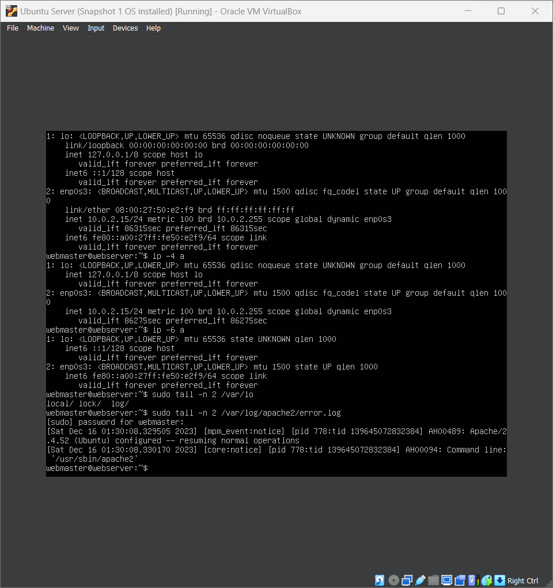

# Deliverable 2

## What are the server hardware specifications
.png)

## What is Ubuntu server log in screen?

## What Is THe IP address of your Ubuntu Server Virtual Machine

+ By Using ip -4 a or ip -6 a we can find our IPV4 addresses as well as our IPV6 addresses

+ IPV4
  + 127.0.0.1/8
  + 10.0.2.15/24
+ IPV6
  + fe80::a00:27ff::f350:e2f9/64

## How do you enable the Ubuntu Firewall?

+ sudo ufw enable

## How do you check if the Ubuntu Firewall is running

+ sudo ufw status

## How do you disable the Ubuntu Firewall

+ sudo UFW disable.

## How do you add Apache to the Firewall

+ sudo ufw allow 'Apache'

## What is the command you used to install Apache

+ sudo apt install apache2 -y

## What is the command you use to check is Apache is running 

+ systemctl status apache2 --no-pager

## What is the command you use to stop Apache

+ sudo systemctl stop apache2.

## What is the command you use to restart Apache

+ sudo systemctl restart apache2

## What is the command used to test Apache configuration

+ sudo apachectl -t

## What is the command used to check the installed version of Apache? 

+ sudo apache2 -v

## What are the most common commands to troubleshoot Apache errors? Provide a brief description of each command

+ sudo systemctl status apache2.service -l --no-pager
  + this is the first step in troubleshooting Apache, You must inspect the state of processes on your system.
  + If apache does not show active running in the processes it could be an indication that your server has an error
+ sudo journalctl -u apache2.service --since today --no-pager
  + To troubleshoot further into your configuration we can use this command to inspect the system logs.
  + These logs are seperate from other logs in the APache server and only describe the apache service itself 
  + If there is an error you should see an output that shows the Apache HTTP server failed to start. If there is an error messege you can check for errors further into the configuration with another command 
+ sudo apachectl configtest
  + This command will go through your Apache files and detect any errors or missing settings before attempting to start the server 
  + If an error is found this command will notify you in the output what the error is. However finding a solution for the error can be found in the Apache error log where more detailed information can often be found.

## Which are APache Log FIles and what are they used for? Provide examples and screenshots 

+ Apache log files are a recourse for troubleshooting. For the majority of errors on Apache there is a corresponding entry on the Apache error log
+ sudo tail -n 2 /var/log/apache2/error.log
  + This command will show you the last two lines of the error log of an Ubuntu server
    + this is where text handling commands start becoming incredibly useful

