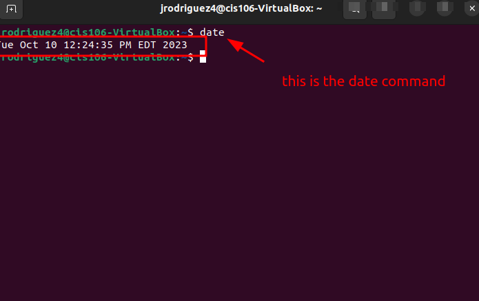

# Lab 3 Submission

## Question 1

## Question 2

## Question 3
| Program purpose     | Package Name      | Version           |
| ------------------- | ----------------- | ----------------- |
| Play a tetris game  | block attack      | 2.7.0-1           |
| Play a video file   | dragon player     | 4:21.12.3         |
| Browse the internet | firefox           | 1:1snap1-0ubuntu2 |
| Read your email     | plasma gmail-feed | 1.1-2             |
| Play music          | clementine        | 1.4.0~            |
## Question 4

| command | what it does                                                            |
| ------- | ----------------------------------------------------------------------- |
| echo    | Prints what is in quotes to the terminal                                |
| fortune | fortune - print a random, hopefully interesting   adage                 |
| cowsay  | cowsay/cowthink - configurable speaking/thinking cow (and a bit more)   |
| lolcat  | lolcat - rainbow coloring effect for text console display               |
| figlet  | FIGlet - display large characters made up of ordinary screen characters |
| toilet  | TOIlet - display large colourful characters                             |
| rig     | RIG - Random Identity Generator                                         |
|         |