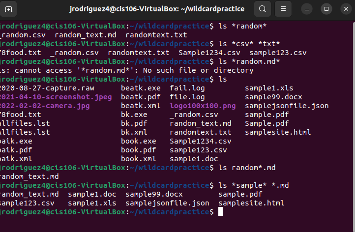
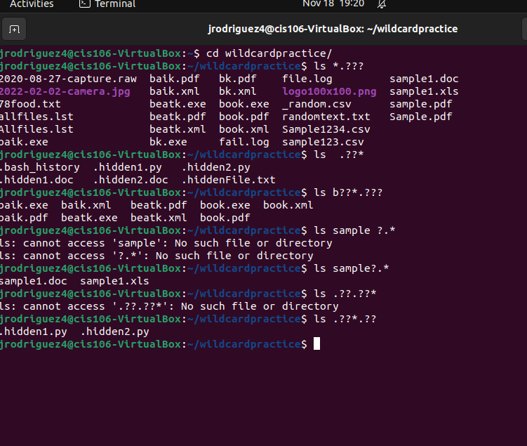
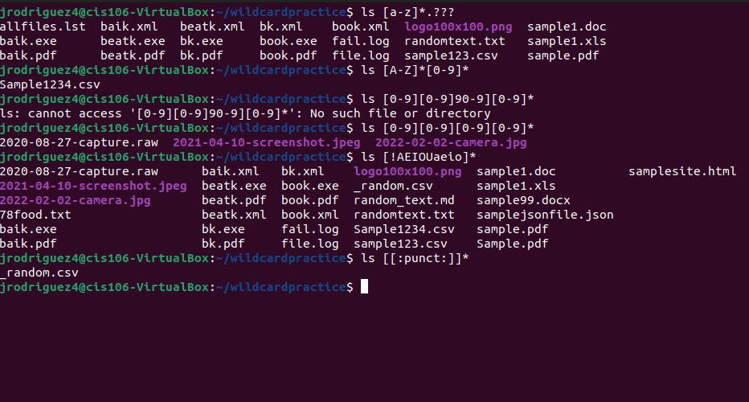

# Week Report 6

## Wildcards.

## * Wildcard

The * is sued to match any number of characters.

  *  ls *.txt will match files that end in .txt
  *  ls *.pdf will match files end in pdf 
  *  ls *file. will match the file that have the word "file" in it  

## ? Wildcard

The ? will look for the amount of characters. like *.?? will give you any file extension with two characters 

* ls .,.??* will list all the hidden files in working directory
* ls b??k* Lists all the files that have two characters between letter b and k
* ls f?l* will return a files with a single character between f and l

## [] Wildcard

The [] will match a single character in a range

* ls f[aeiou]* will search for files with a vowel after the f 
* ls f[a!eiou]* will search for files WITHOUT a vowel after the f
* ls f[a-z]* will search for every letter after f 

## Brace Expansion

not a wildcard but a feature of bash that lets you make strings to use with commands 

* mkdir -p music/{jazz,rock}/{mp3files,videos,oggfiles}/new will create two directories each having three directories with the same name and the "new" directory inside of those.
* touch website{1..5}.html will create a webstie.html file with number 1 - 5 at the end
* touch files{A-Z}.txt will create a file for each letter of the alphabet starting with files

## Practice

* Practice 5
  
* Practice 6
  
* Practice 7
  
  