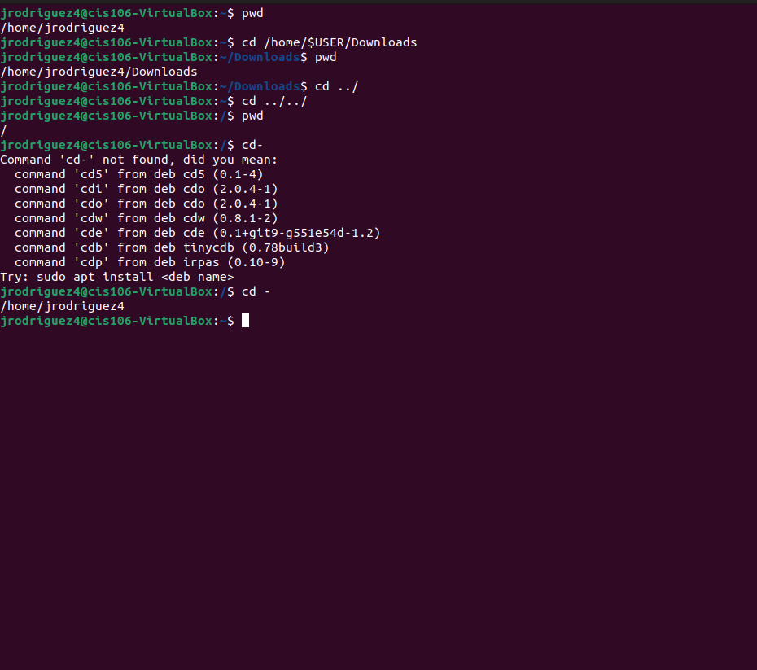
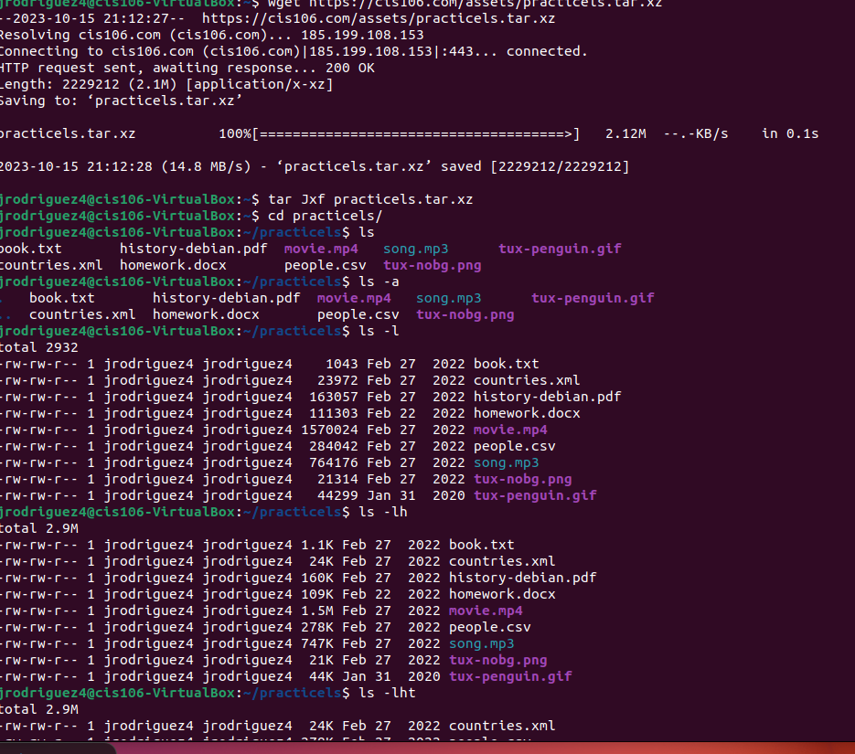
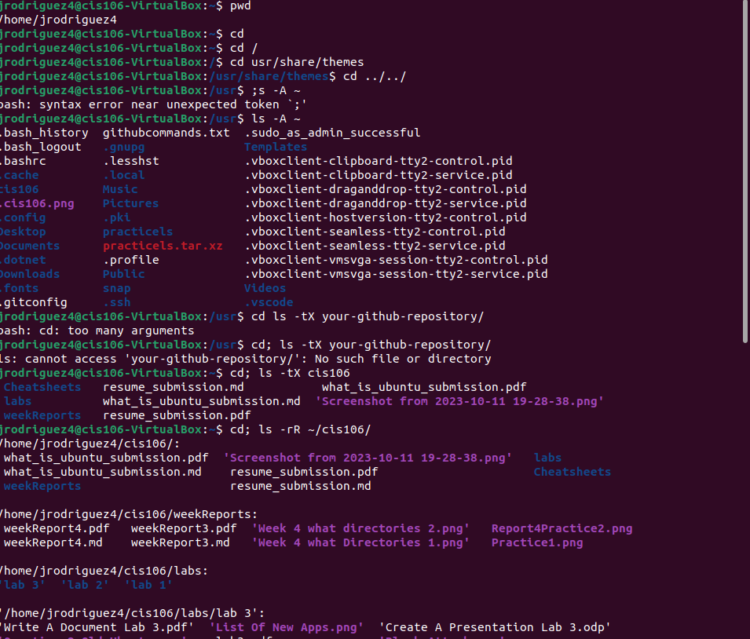

# Week Report 4

## Practice From Presentation The Linus File System:
### Practice 1

### Practice 2

### Practice 3

## The Linus File system directories and their purpose

## All the commands for navigating the filesystem

| Command | What it does                                                  | Syntax                                   | Example       |
| ------- | ------------------------------------------------------------- | ---------------------------------------- | ------------- |
| pwd     | displays your current working directory                       | pwd                                      | `pwd  `       |
| cd      | Used for changing your current directory absolute or relative | `cd home or cs ../ or cd /home/blah blah | `cd /home`    |
| ls      | shows list of folders withing that directory                  | ls + option + directory to list          | `ls /Picture` |

## Basic Terminology

**File system**

The way files are stored and organized in ubuntu

**Current directory**

The directory where you are at the moment

**parent directory**

A directory that comes before another one (held inside)

**the difference between your home directory and the home directory**

+ Your home directory is a folder that stores your current working directory for individual users
+ THE HOME directory is the place where all the individual home directories are stored

**pathname**

the location of a file ( like an address)

**relative path**

the address or path RELATIVE to your current working directory 
No /

**absolute path**

the address or path ABSOLUTE from the ROOT 
contains /

