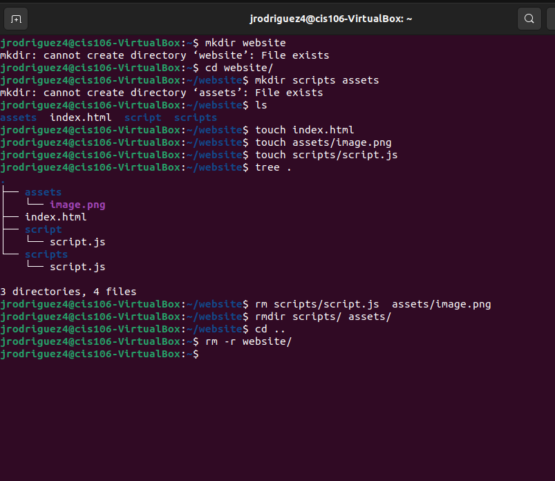
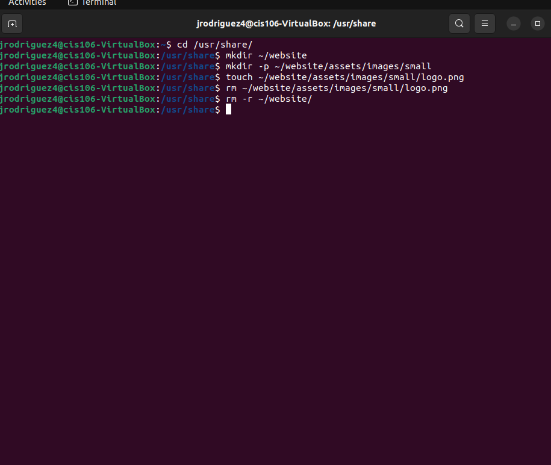
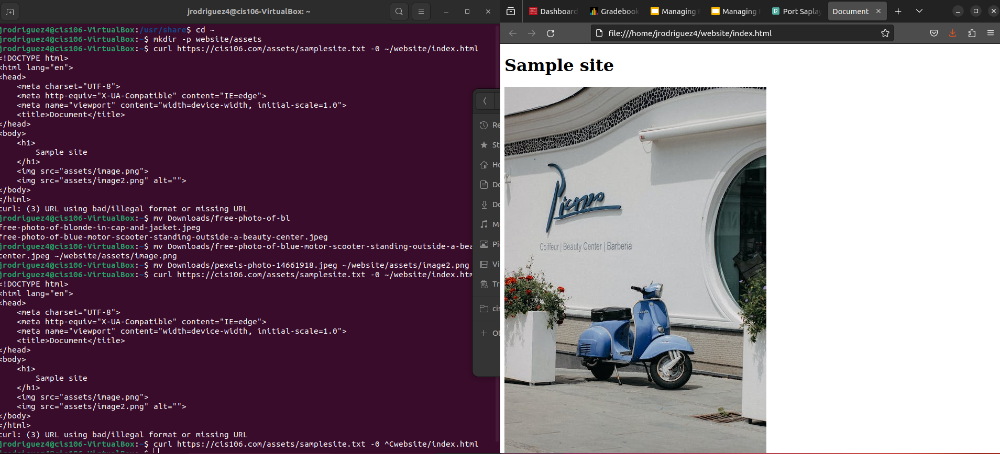
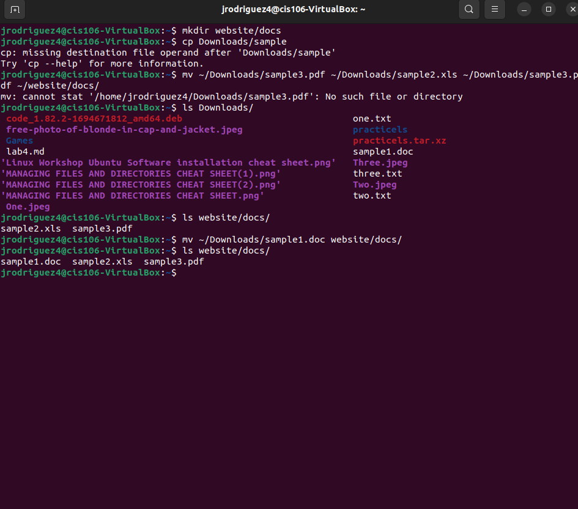

# Week Report 5

## Answer To Questions:

* **What are Command Options?**

Options modify/enhance the behavior of a linux terminal command

* **What are Command Arguments?**

Arguments are items the command acts on, such as files or directories

* **Which command is used for creating directories? Provide at least 3 examples.**
  
The Command is mkdir
* this command makes directories (folders)
* mkdir + name of directory
  * 1: mkdir DogPictures
  * 2: mkdir ~/Downloads/PuppyPictures
  * 3: mkdir ~/Downloads/PuppyPictures/GoldenRetriever

* **What does the touch command do? Provide at least 3 examples.**

The Touch command creates files
* touch name of file
  * 1: touch list.txt
  * 2: touch script.py
  * 3: touch ~/Downloads/PuppyPictures/HelloWorld.js

* **How do you remove a file? Provide an example.**

rm removes files
* rm ~Downloads/PuppyPictures/HelloWorld.js

* **How do you remove a directory and can you remove non-empty directories in Linux? Provide an example**

You cannot remove non empty directories in linux you must use the -r option 
* rm -r directory name/path

* **Explain the mv and cp command. Provide at least 2 examples of each**

mv moves and renames files
* 1: mv ~/Downloads/PuppyPictures/HelloWorld.js ~/Downloads/JavaScript/GoodByeWorld.js
* 2: mv ~/Downloads/text.txt ~/Documents/

cp copes files and directories
* 1: cp text.txt ~/Downloads/JavaScript/
* 2: cp Downloads/Wallpapers.zip Pictures/
  
## Practice 1

## Practice 2

## Practice 3

## Practice 4

